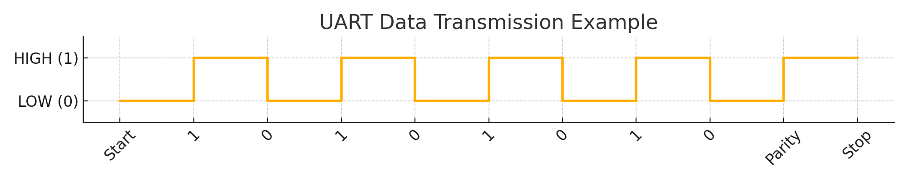

# UART (Universal Asynchronous Receiver/Transmitter) Communication Protocol

## 🔹 1. What is UART?

**UART** stands for **Universal Asynchronous Receiver/Transmitter**. It is a **serial communication protocol** used for asynchronous transmission of data between two devices.

- It is **not a communication protocol** like SPI or I2C, but rather a **hardware-based interface** that facilitates asynchronous serial communication.
- UART transmits data **bit by bit** (serial) over a single wire, without a shared clock.

---

## 🔹 2. Key Features
- **Asynchronous** (no clock signal required)
- **Full duplex** (can send and receive simultaneously)
- Typically used for **short-distance** communication
- Commonly used in **embedded systems, microcontrollers, GPS, Bluetooth modules**, etc.

---

## 🔹 3. How UART Works

### ➤ Communication Lines:
- **TX (Transmit)** – sends data
- **RX (Receive)** – receives data
- (Sometimes **GND** – common ground between devices)

### ➤ Data Frame Format:
A typical UART data frame includes:

```
Start Bit | Data Bits (5-9 bits) | Optional Parity Bit | Stop Bit(s) (1 or 2)
```

- **Start bit**: Signals the beginning of a data frame (always 0)
- **Data bits**: Actual data (typically 8 bits)
- **Parity bit**: Optional error checking bit
- **Stop bit(s)**: Signals end of data frame (1 or 2 bits, always 1)

---

## 🔹 4. Types of UART Communication

### ➤ Based on Direction:
- **Simplex** – One-way only
- **Half-Duplex** – Both directions, but one at a time
- **Full-Duplex** – Simultaneous send/receive (typical UART usage)

### ➤ Based on Configuration:
- **Hardware UART** – Built into microcontrollers (faster, reliable)
- **Software UART (bit-banging)** – Emulated using GPIOs (less efficient, flexible pin use)

---

## 🔹 5. Modes of UART Operation

### ➤ Polling Mode:
- The CPU continuously checks if data is available (CPU intensive)

### ➤ Interrupt Mode:
- UART interrupts the CPU when data is available, allowing efficient CPU use

### ➤ DMA (Direct Memory Access) Mode:
- Data is transferred directly to/from memory with minimal CPU involvement (used in high-speed applications)

---

## 🔹 6. UART Parameters

| Parameter        | Typical Values       |
|------------------|----------------------|
| **Baud Rate**     | 9600, 115200, etc.   |
| **Data Bits**     | 5 to 9 (usually 8)   |
| **Parity**        | None, Even, Odd      |
| **Stop Bits**     | 1 or 2               |
| **Flow Control**  | None, RTS/CTS        |

---

## 🔹 7. UART vs Other Protocols

| Feature         | UART       | SPI           | I2C          |
|------------------|------------|---------------|--------------|
| Clock Required   | ❌ No       | ✅ Yes         | ✅ Yes        |
| Pins Required    | 2 (TX, RX) | 4 (MISO, MOSI, SCK, SS) | 2 (SDA, SCL) |
| Speed            | Medium     | High          | Medium       |
| Full Duplex      | ✅ Yes      | ✅ Yes         | ❌ No         |
| Number of Devices| 1-to-1     | 1-to-Many     | Many         |

---

## 🔹 8. Advantages of UART

- Simple and widely supported
- Only 2 wires needed (TX/RX)
- No need for clock synchronization
- Full-duplex communication
- Commonly supported in microcontrollers

---

## 🔹 9. Disadvantages of UART

- Limited to **1-to-1** device communication
- Speed is lower than SPI
- Short-distance communication only
- Frame errors if baud rates are mismatched
- No built-in addressing (unlike I2C)

---

## 🔹 10. Common Uses of UART

- **Microcontroller-to-PC** communication
- Serial consoles (debugging)
- Connecting modules (Bluetooth, GPS, GSM, etc.)
- Communication between two MCUs
- Embedded Linux systems (e.g., Raspberry Pi)

---

## 🔹 11. Common Baud Rates

| Baud Rate  | Use Case                        |
|------------|----------------------------------|
| 9600       | Standard serial communication    |
| 38400      | Faster but still reliable        |
| 115200     | High-speed UART, commonly used   |

> 📌 *Baud rate must be the same on both transmitter and receiver sides.*

---

## 🔹 12. Error Detection in UART

- **Parity Bit**: Simple error checking
- **Framing Error**: If stop bit is not received correctly
- **Overrun Error**: Receiver gets data before previous data is read

---

## 🔹 13. Flow Control Mechanisms

- **Software**: XON/XOFF
- **Hardware**: RTS (Request to Send) / CTS (Clear to Send)

Flow control helps avoid data loss in high-speed or buffered communication.


---

## 🔹 14. UART Data Transmission Diagram

Below is a sample UART transmission of the data byte `0xAA` (binary `10101010`) with a parity and stop bit.



- **Start Bit**: LOW (0) indicates the beginning of transmission.
- **Data Bits**: 8 bits, LSB first. Here it's `10101010`.
- **Parity Bit**: Simple parity for error detection (in this case, odd parity).
- **Stop Bit**: HIGH (1) indicates the end of the data frame.

---

## 🔹 Inter-board vs Intra-board Communication

### 🔸 **1. Definitions**

| Term                          | Definition |
|-------------------------------|------------|
| **Inter-board Communication** | Communication between **two or more separate physical boards** (PCBs), typically connected by wires, cables, or connectors. |
| **Intra-board Communication** | Communication **within a single PCB** (printed circuit board), typically between ICs (integrated circuits), microcontrollers, sensors, and other components. |

---

## 🔹 Baud Rate vs Bit Rate

### 🔸 **1. Definitions**

| Term        | Description |
|-------------|-------------|
| **Baud Rate** | Number of **signal changes (symbols)** per second on a communication channel. |
| **Bit Rate**  | Number of **data bits transmitted** per second. |

> 🔍 **Baud Rate ≠ Bit Rate**, especially when **more than 1 bit is encoded per symbol** (e.g., advanced modulation schemes).

---

### 🔸 **2. Formula**

```
Bit Rate = Baud Rate × Number of Bits per Symbol
```

- In simple systems like **UART**, usually:
  ```
  1 baud = 1 bit/sec
  ```
- In complex modulations (e.g., QPSK, 16-QAM), 1 baud can carry multiple bits.

---

### 🔸 **3. Example Scenarios**

#### 🧩 **UART (Simple Serial Communication)**

- **Baud Rate**: 9600 baud  
- **Bits per Symbol**: 1  
- **Bit Rate** = 9600 × 1 = **9600 bits/sec**

#### 🧩 **QPSK (Quadrature Phase Shift Keying)**

- **Baud Rate**: 9600 baud  
- **Bits per Symbol**: 2  
- **Bit Rate** = 9600 × 2 = **19200 bits/sec**

---

### 🔸 **4. Visual Analogy**

| Metric        | Analogy                   |
|---------------|---------------------------|
| Baud Rate     | Number of envelopes sent per second |
| Bit Rate      | Number of letters inside each envelope |
| Relation      | More bits/symbol = more efficient data transfer |

---

### 🔸 **5. Key Differences**

| Feature       | Baud Rate                  | Bit Rate                     |
|---------------|----------------------------|-------------------------------|
| Unit          | Symbols/sec                | Bits/sec                      |
| Measures      | Signal changes             | Actual data transmitted       |
| Can be Equal? | Yes, in simple modulation  | No, in advanced modulation    |
| Example Use   | Describing transmission speed | Data capacity or bandwidth  |

---

### 🔸 **6. Practical Notes for UART**

- Even though **baud rate and bit rate** are often used interchangeably in UART, the **actual bit rate includes start/stop/parity bits**.
- So, **effective data rate** is slightly less than baud rate.

> 📌 Example:  
> At **9600 baud**, with **8 data bits, 1 start, 1 stop, no parity**, you transmit **10 bits per byte**, so effective data rate:
> ```
> 9600 / 10 = 960 bytes/sec
> ```


---
